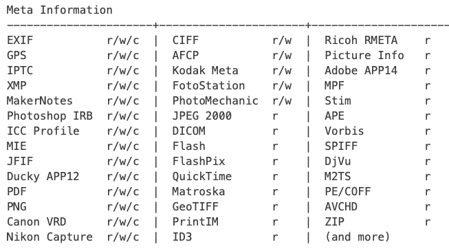

# Exercise 1 - File metadata

### **Are the metadata of both files equal or different?**

As we can see in the image below, with the command **diff** we are comparing the metadata of the original image and the one after being downloaded from Whatsapp, in this case.

The commands to get the metadata of the file was:

exiftool -s -G /path/to/the/image > /path/to/metadata/file

<figure><figcaption></figcaption></figure>

After analyzing the metadata, we can conclude that some parts of the metadata of the original image have changed. In the next section, we can see what metadata has been removed from the original image. In a general view, the \[File] metadata related to the file size, modify, access and inode change date have changed and all the \[QuickTime], \[EXIF], \[MakerNotes], \[XMP], \[ICC\_Profile] and most \[Composite] meta information have been removed. This is because most social media platforms remove some metadata to ensure the privacy of the users. In this case the file type has also changed because Apple uses HEIC format and when downloading it from the social media platform it is converted to a most common one like jpeg, png or jpg. &#x20;

### **If so, what file-tags are different?**

```
< [File]          FileName                        : original.HEIC
---
> [File]          FileName                        : after.jpeg
4,7c4,7
< [File]          FileSize                        : 2.2 MB
< [File]          FileModifyDate                  : 2023:04:23 13:35:42+02:00
< [File]          FileAccessDate                  : 2023:05:06 18:33:23+02:00
< [File]          FileInodeChangeDate             : 2023:05:06 18:33:21+02:00
---
> [File]          FileSize                        : 129 kB
> [File]          FileModifyDate                  : 2023:05:06 18:35:34+02:00
> [File]          FileAccessDate                  : 2023:05:06 18:35:36+02:00
> [File]          FileInodeChangeDate             : 2023:05:06 18:35:34+02:00
9,152c9,23
< [File]          FileType                        : HEIC
< [File]          FileTypeExtension               : heic
< [File]          MIMEType                        : image/heic
< [File]          ExifByteOrder                   : Big-endian (Motorola, MM)
< [File]          ImageWidth                      : 2268
< [File]          ImageHeight                     : 4032
< [QuickTime]     MajorBrand                      : High Efficiency Image Format HEVC still image (.HEIC)
< [QuickTime]     MinorVersion                    : 0.0.0
< [QuickTime]     CompatibleBrands                : mif1, MiHE, miaf, MiHB, heic
< [QuickTime]     HandlerType                     : Picture
< [QuickTime]     PrimaryItemReference            : 41
< [QuickTime]     MetaImageSize                   : 2268x4032
< [QuickTime]     HEVCConfigurationVersion        : 1
< [QuickTime]     GeneralProfileSpace             : Conforming
< [QuickTime]     GeneralTierFlag                 : Main Tier
< [QuickTime]     GeneralProfileIDC               : Main Still Picture
< [QuickTime]     GenProfileCompatibilityFlags    : Main Still Picture, Main 10, Main
< [QuickTime]     ConstraintIndicatorFlags        : 176 0 0 0 0 0
< [QuickTime]     GeneralLevelIDC                 : 90 (level 3.0)
< [QuickTime]     MinSpatialSegmentationIDC       : 0
< [QuickTime]     ParallelismType                 : 0
< [QuickTime]     ChromaFormat                    : 4:2:0
< [QuickTime]     BitDepthLuma                    : 8
< [QuickTime]     BitDepthChroma                  : 8
< [QuickTime]     AverageFrameRate                : 0
< [QuickTime]     ConstantFrameRate               : Unknown
< [QuickTime]     NumTemporalLayers               : 1
< [QuickTime]     TemporalIDNested                : No
< [QuickTime]     ImageSpatialExtent              : 2268x4032
< [QuickTime]     Rotation                        : 0
< [QuickTime]     ImagePixelDepth                 : 8
< [QuickTime]     AuxiliaryImageType              : urn:com:apple:photo:2020:aux:hdrgainmap
< [QuickTime]     MediaDataSize                   : 2184395
< [QuickTime]     MediaDataOffset                 : 3268
< [EXIF]          Make                            : Apple
< [EXIF]          Model                           : iPhone 13 Pro Max
< [EXIF]          Orientation                     : Horizontal (normal)
< [EXIF]          XResolution                     : 72
< [EXIF]          YResolution                     : 72
< [EXIF]          ResolutionUnit                  : inches
< [EXIF]          Software                        : 16.3.1
< [EXIF]          HostComputer                    : iPhone 13 Pro Max
< [EXIF]          TileWidth                       : 512
< [EXIF]          TileLength                      : 512
< [EXIF]          ExposureTime                    : 1/873
< [EXIF]          FNumber                         : 1.5
< [EXIF]          ExposureProgram                 : Program AE
< [EXIF]          ISO                             : 50
< [EXIF]          ExifVersion                     : 0232
< [EXIF]          DateTimeOriginal                : 2023:04:23 13:31:43
< [EXIF]          OffsetTime                      : +02:00
< [EXIF]          OffsetTimeOriginal              : +02:00
< [EXIF]          OffsetTimeDigitized             : +02:00
< [EXIF]          ShutterSpeedValue               : 1/873
< [EXIF]          ApertureValue                   : 1.5
< [EXIF]          BrightnessValue                 : 7.783697413
< [EXIF]          ExposureCompensation            : 0
< [EXIF]          MeteringMode                    : Multi-segment
< [EXIF]          Flash                           : Off, Did not fire
< [EXIF]          FocalLength                     : 5.7 mm
< [EXIF]          SubjectArea                     : 2317 1471 392 390
< [EXIF]          SubSecTimeOriginal              : 652
< [EXIF]          SubSecTimeDigitized             : 652
< [EXIF]          ColorSpace                      : Uncalibrated
< [EXIF]          ExifImageWidth                  : 4032
< [EXIF]          ExifImageHeight                 : 3024
< [EXIF]          SensingMethod                   : One-chip color area
< [EXIF]          SceneType                       : Directly photographed
< [EXIF]          ExposureMode                    : Auto
< [EXIF]          WhiteBalance                    : Auto
< [EXIF]          FocalLengthIn35mmFormat         : 26 mm
< [EXIF]          LensInfo                        : 1.570000052-9mm f/1.5-2.8
< [EXIF]          LensMake                        : Apple
< [EXIF]          LensModel                       : iPhone 13 Pro Max back triple camera 5.7mm f/1.5
< [EXIF]          CompositeImage                  : General Composite Image
< [EXIF]          GPSLatitudeRef                  : North
< [EXIF]          GPSLongitudeRef                 : West
< [EXIF]          GPSAltitudeRef                  : Above Sea Level
< [EXIF]          GPSSpeedRef                     : km/h
< [EXIF]          GPSSpeed                        : 0
< [EXIF]          GPSImgDirectionRef              : Magnetic North
< [EXIF]          GPSImgDirection                 : 225.3190613
< [EXIF]          GPSDestBearingRef               : Magnetic North
< [EXIF]          GPSDestBearing                  : 225.3190613
< [EXIF]          GPSHPositioningError            : 4.604563058 m
< [MakerNotes]    RunTimeFlags                    : Valid
< [MakerNotes]    RunTimeValue                    : 738047268255666
< [MakerNotes]    RunTimeScale                    : 1000000000
< [MakerNotes]    RunTimeEpoch                    : 0
< [MakerNotes]    AccelerationVector              : -0.04150763527 -0.9949644803 0.02905810997
< [MakerNotes]    FocusDistanceRange              : 0.68 - 1.77 m
< [MakerNotes]    MediaGroupUUID                  : D06C961C-03BE-48C4-8049-3BCDA07DD089
< [MakerNotes]    LivePhotoVideoIndex             : 1112547328
< [XMP]           XMPToolkit                      : XMP Core 6.0.0
< [XMP]           CreateDate                      : 2023:04:23 13:31:43
< [XMP]           CreatorTool                     : 16.3.1
< [XMP]           ModifyDate                      : 2023:04:23 13:31:43
< [XMP]           DateCreated                     : 2023:04:23 13:31:43
< [XMP]           HDRGainMapVersion               : 65536
< [ICC_Profile]   ProfileCMMType                  : Apple Computer Inc.
< [ICC_Profile]   ProfileVersion                  : 4.0.0
< [ICC_Profile]   ProfileClass                    : Display Device Profile
< [ICC_Profile]   ColorSpaceData                  : RGB
< [ICC_Profile]   ProfileConnectionSpace          : XYZ
< [ICC_Profile]   ProfileDateTime                 : 2022:01:01 00:00:00
< [ICC_Profile]   ProfileFileSignature            : acsp
< [ICC_Profile]   PrimaryPlatform                 : Apple Computer Inc.
< [ICC_Profile]   CMMFlags                        : Not Embedded, Independent
< [ICC_Profile]   DeviceManufacturer              : Apple Computer Inc.
< [ICC_Profile]   DeviceModel                     : 
< [ICC_Profile]   DeviceAttributes                : Reflective, Glossy, Positive, Color
< [ICC_Profile]   RenderingIntent                 : Perceptual
< [ICC_Profile]   ConnectionSpaceIlluminant       : 0.9642 1 0.82491
< [ICC_Profile]   ProfileCreator                  : Apple Computer Inc.
< [ICC_Profile]   ProfileID                       : ecfda38e388547c36db4bd4f7ada182f
< [ICC_Profile]   ProfileDescription              : Display P3
< [ICC_Profile]   ProfileCopyright                : Copyright Apple Inc., 2022
< [ICC_Profile]   MediaWhitePoint                 : 0.96419 1 0.82489
< [ICC_Profile]   RedMatrixColumn                 : 0.51512 0.2412 -0.00105
< [ICC_Profile]   GreenMatrixColumn               : 0.29198 0.69225 0.04189
< [ICC_Profile]   BlueMatrixColumn                : 0.1571 0.06657 0.78407
< [ICC_Profile]   RedTRC                          : (Binary data 32 bytes, use -b option to extract)
< [ICC_Profile]   ChromaticAdaptation             : 1.04788 0.02292 -0.0502 0.02959 0.99048 -0.01706 -0.00923 0.01508 0.75168
< [ICC_Profile]   BlueTRC                         : (Binary data 32 bytes, use -b option to extract)
< [ICC_Profile]   GreenTRC                        : (Binary data 32 bytes, use -b option to extract)
< [Composite]     RunTimeSincePowerUp             : 8 days 13:00:47
< [Composite]     Aperture                        : 1.5
< [Composite]     ImageSize                       : 2268x4032
< [Composite]     Megapixels                      : 9.1
< [Composite]     ScaleFactor35efl                : 4.6
< [Composite]     ShutterSpeed                    : 1/873
< [Composite]     SubSecCreateDate                : 2023:04:23 13:31:43.652+02:00
< [Composite]     SubSecDateTimeOriginal          : 2023:04:23 13:31:43.652+02:00
< [Composite]     SubSecModifyDate                : 2023:04:23 13:31:43+02:00
< [Composite]     GPSAltitude                     : 667.3 m Above Sea Level
< [Composite]     GPSLatitude                     : 40 deg 24' 59.21" N
< [Composite]     GPSLongitude                    : 3 deg 40' 54.79" W
< [Composite]     CircleOfConfusion               : 0.007 mm
< [Composite]     FOV                             : 69.4 deg
< [Composite]     FocalLength35efl                : 5.7 mm (35 mm equivalent: 26.0 mm)
< [Composite]     GPSPosition                     : 40 deg 24' 59.21" N, 3 deg 40' 54.79" W
< [Composite]     HyperfocalDistance              : 3.29 m
< [Composite]     LightValue                      : 11.9
< [Composite]     LensID                          : iPhone 13 Pro Max back triple camera 5.7mm f/1.5
---
> [File]          FileType                        : JPEG
> [File]          FileTypeExtension               : jpg
> [File]          MIMEType                        : image/jpeg
> [File]          ImageWidth                      : 576
> [File]          ImageHeight                     : 1024
> [File]          EncodingProcess                 : Progressive DCT, Huffman coding
> [File]          BitsPerSample                   : 8
> [File]          ColorComponents                 : 3
> [File]          YCbCrSubSampling                : YCbCr4:2:0 (2 2)
> [JFIF]          JFIFVersion                     : 1.01
> [JFIF]          ResolutionUnit                  : None
> [JFIF]          XResolution                     : 1
> [JFIF]          YResolution                     : 1
> [Composite]     ImageSize                       : 576x1024
> [Composite]     Megapixels                      : 0.590
```

### **Can the metadata of a file be manipulated?**

There are some metadata tags that are writable and others that are not. For example, if we try to modify the FileType, the output of the command would be the following:

.png>)

In this case, we demonstrate that there are some tags that can be modified.

.png>)

From the exiftool manual we can see the different metadata information and whether they can be read, written or created.



### **Is the metadata of a file useful as evidence for a CF case?**

The metadata is very useful in Computer Forensics cases, as normally there is valuable information contained in them. An interesting example would be the GPS location where the photo was taken, if it is enabled on the owner device.

.png>)
