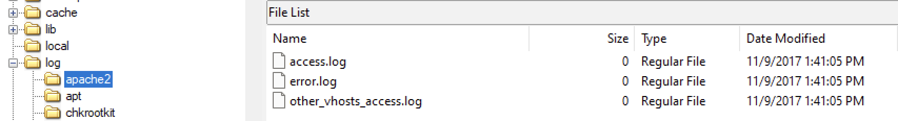
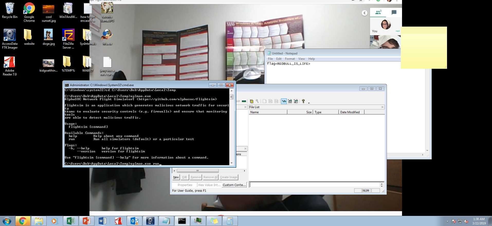
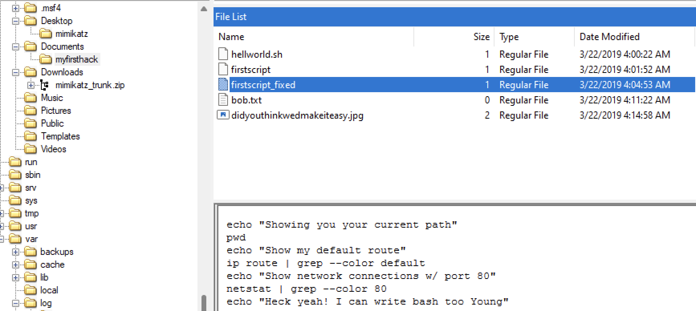

# Exercise 11 - Linux analysis

**Imagine that your partner has created a forensic image of a computer using AcessData. She provided you with the files (Horcrux.E01, Horcrux.E02, ..., Horcrux.E014) and the file Horcrux.E01.txt that provided the details of the acquisition process. Concerning “Partition 5”, you must help her/him with the following questions:**

1. **What distribution of Linux is being used on this machine?**

As it can be seen in the image below, the fifth partition is a Linux partition and within the boot section it can be seen that it is a kali distribution.

<figure><figcaption></figcaption></figure>

2. **What is the MD5 hash of the apache access.log?**

Assuming that all the logs are located within the /var/log/ directory, looking for the apache2 logs we can see that there is a log file called _access.log_. By right clicking on it, we can select the option ‘Export File Hash List’ to dump a .csv file where the hash value is located.

<figure><figcaption></figcaption></figure>

In the image below the hash value can be seen.

<figure><figcaption></figcaption></figure>

3. **It is believed that a credential dumping tool was downloaded. What is the**\
   **file name of the download?**

By moving to the Downloads directory within the root directory we can find a zip file called ‘_mimikatz\_trunk.zip’_ and Mimikatz is a tool for credential dumping, so it is supposed that the tool downloaded is that one.

<figure><figcaption></figcaption></figure>

4. **There was a super secret file created, what is the absolute path?**

By inspecting the content at the file containing the bash history, we can see the exact command used to create the file and in what location. In this case, the file was stored in the _/root/Desktop_ directory, so the absolute path is _/root/Desktop/SuperSecretFile.txt._

<figure><figcaption></figcaption></figure>

5. **What program used “didyouthinkwedmakeiteasy.jpg” during execution?**

If we keep inspecting the bash history, in the image below it can be seen that the program using the image as an argument was _binwalk_.

<figure><figcaption></figcaption></figure>

6. **What is the third goal from the checklist Karen created?**

If we inspect the desktop, we can see a folder called _mimikatz_ and a file called ‘_Checklist_’, whose third goal is apparently ‘Profit’.

<figure><figcaption></figcaption></figure>

7. **How many times has apache run?**

Going back and analyzing the file _access.log_, we can see that the size is 0 bytes, which may suggest that Apache was never run.

<figure><figcaption></figcaption></figure>

8. **It is believed this machine was used to attack another, what file proves**\
   **this?**

If we inspect the root directory, we can see a screenshot of what looks like a hacked machine. The second image shows its content and this may prove that this machine was used to attack other machines.

<figure><figcaption></figcaption></figure>

<figure><figcaption></figcaption></figure>

9. **Within the Documents file path, it is believed that Karen was taunting a**\
   **fellow computer expert through a bash script. Who was Karen taunting?**

In that path, there is a folder called _‘myfirsthack’_ and inspecting the content, there are several files and one of them called _‘firstscript\_fixed’_ contains an echo message referring to someone called ‘Young’, who may be the person that Karen was taunting.

<figure><figcaption></figcaption></figure>

10. **A user sudo to root at 11:26 multiple times. Who was it?**

If we inspect the file _/var/log/auth.log_ it is very easy to notice that the user **postgres** sudoed to root multiple times at the specified time.

<figure><figcaption></figcaption></figure>

11. **Based on the bash history, what is the current working directory?**

The last command trying to change the directory was used to change to _/root/Documents/myfirsthack/_ and any of the following executed commands was used to modify the current working directory.

.png>)
