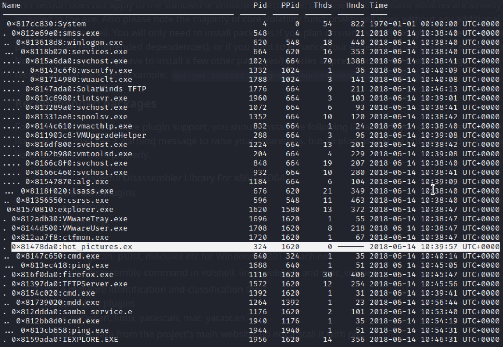

# Exercise 5 - Memory analysis

### Can you identify the attacker’s IP address? 

The first step in every forensic activity is checking the integrity of the image by computing the hash and comparing it at the end of the exercise to ensure that the evidence has not been changed.

.png>)

To get a high level summary of the memory image provided, the command _imageinfo_ provides some general information such as the operating system, service pack and hardware architecture, but also some other useful information like the DTB address and the time the sample was collected. In this case, the profile is the important information for future commands to get further information about the memory dump. The command used can be seen in the following line and the output of the command in the image below. As we can see, the suggested profile corresponds to a WinXPSPA2x86.

`python2 vol.py -f ../memdump imageinfo`

.png>)

With the obtained profile, we can list the processes using the command _pstree_ and also specifying the profile, as it can be seen in the line below.

`python2 vol.py -f ../memdump --profile=WinXPSP2x86 pstree`

From the output of the command we can see the list of processes. As we can see in the image below, there are some interesting processes like _hot\_pictures.ex_, _cmd.exe_, _samba\_service.e_, among others.

Using the _connscan_ command we can find the artifacts of the different connections. By inspecting the output of the command shown in the image below, there is a suspicious connection to a remote host whose IP address is 192.168.21.161 on port 445. This may be the evidence to demonstrate that there is some connection to a remote host which could be a backdoor or the IP address of a server which hosts pieces of malware that are trying to be downloaded. The rest of the connections seem to be legitimate as most of them are requests and responses to HTTP (port 80) or HTTPS servers (port 443). The command used to list all the connections is the following:

`python2 vol.py -f ../memdump --profile=WinXPSP2x86 connscan`

.png>)

As we could see in the processes list, there are some processes called _cmd.exe_. Volatile also offers the possibility to list the commands entered through a shell using either the command _cmdscan_ or _consoles_. The advantage of the command _consoles_ is that apart from listing the shell commands that were entered, it also shows the result of them. In this case, the command can be seen in the following line. In the image below, we can see the output of the command, where we can see commands like _ipconfig_ or _ping 192.168.21.161_, which is supposed to be the attacker’s IP address.

`python2 vol.py -f ../memdump --profile=WinXPSP2x86 cmdscan`

.png>)

**Volatile** has much more functionality than explained in this exercise. In fact, there are a large variety of plugins and commands and is also customizable. In this case, as the process called _hot\_pictures.ex_ caught my attention, using the _memdump_ command we can try to dump the process’s executable. However, it is not possible due to paging. The command and the output can be seen in the line and image below.

`python2 vol.py -f ../memdump procdump --profile=WinXPSP2x86 -D ../output/ -p 324`

.png>)
