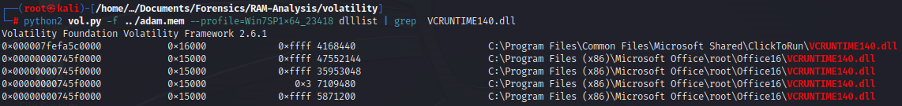

# Exercise 6 - RAM analysis

The first step is checking the integrity of the file to analyze.

.png>)

### What profile is the most appropriate for this machine? (ex: Win10x86\_14393) 

The command _imageinfo_ only provides the suggested profiles whereas the command _kdbgscan_ determines the correct profile. In the following images we can determine the differences provided by both commands.

`python2 vol.py -f ../adam.mem imageinfo`

.png>)

`python2 vol.py -f ../adam.mem kdbgscan`

.png>)

### What was the process ID of notepad.exe? 

There are several commands that can be used to list the processes of the memory dump image. In this case, the command _pslist_ or _pstree_ are two of the alternatives. Using the command _pslist_ we obtain the list of processes in the memory image provided, as it can be seen in the image below. The PID of the process notepad.exe is 3032. The command used is the following:

`python2 vol.py -f ../adam.mem --profile=Win7SP1x64_23418 pslist`

.png>)

### Name the child processes of wscript.exe. 

There are two ways of obtaining the child processes of wscript.exe, using the command _pslist_ and looking for every process having the Parent PID of wscript.exe or using the command _pstree_ which shows in a graphical way the child processes of every process if they have.

.png>)

Using the following command, we can see in the image below how the child processes are represented. In this case, the direct child process of wscript.exe is UWkpjFjDzM.exe.

`python2 vol.py -f ../adam.mem --profile=Win7SP1x64_23418 pstree`

.png>)

### What was the IP address of the machine at the time the RAM dump was created? 

To scan for network artifacts the command _netscan_ can be used. Thus, to get the IP address of the local machine the following command is used. As it can be seen in the image below, the IP address of the machine is **10.0.0.101**.

`python2 vol.py -f ../adam.mem --profile=Win7SP1x64_23418 netscan`

.png>)

### Based on the answer regarding the infected PID, can you determine what was the IP of the attacker? 

As we can see, there is a connection performed by the process UWkpjFjDzM.exe from the local IP address to the address 10.0.0.106, which might be the attacker’s IP address.

.png>)

### What process name is VCRUNTIME140.dll associated with? 

To list the DLLs that have been loaded by a process, the command _dlllist_ can be used. In this case, with grep we can get the times that the DLL was loaded but the PID of the processes is not shown. If we inspect the whole response of the command, which is massive, we can determine that there are five associated processes to this DLL, including Excel, Powerpoint and Outlook, but there is a suspicious one called OfficeClickToR with PID 1136.

`python2 vol.py -f ../adam.mem --profile=Win7SP1x64_23418 dlllist`

.png>)

### What is the md5 hash value of the potential malware on the system? 

The potential malware sample seems to be UWkpjFjDzM.exe. There is a command called _procdump_ that can be used to dump the process executable to then compute the hash.

`python2 vol.py -f ../adam.mem --profile=Win7SP1x64_23418 -D ../recovered -p 3496 procdump`

.png>)

Then, to generate the MD5 hash of the malware sample is the following:

.png>)

### An application was run at 2019-03-07 23:06:58 UTC, what's the name of the program? (Include extension) 

There is a command called _shimcache_ that can be used to list the executed applications in addition to the timestamps of their executions. Thus, as it can be seen in the image below, we are using grep to get the specific application, which in this case is Skype.exe.

.png>)

### What is the short name of the file at file record 59045? 

Volatility provides a command called _mftparser_ which scans for the entries in the Master File Table. In this case, we are using grep to reduce the amount of printed information and to be more specific. As it can be seen, the shortname of the file is Users\Bob\DOCUME\~1\EMPLOY\~1\EMPLOY\~1.XLS

.png>)

### This box was exploited and is a running meterpreter. What PID was infected? 

As we stated before, the malware seems to be UWkpjFjDzM.exe. Furthermore, by inspecting the result of the _netscan_ command, as we can see in the image below, the port to which the connection is established on the attacker’s machine is 4444, which is the default port used by Metasploit. This might be a clue to determine that the meterpreter session is carried out in this connection. The infected PID is then 3496.

.png>)
