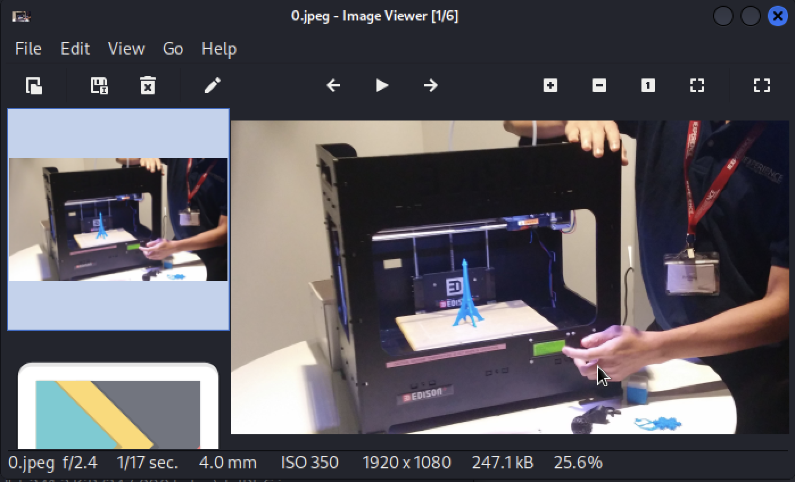

# Basic Static Analysis - Day 1

The lab environment consists of two virtual machines, one Windows 10 machine which is going to have the malware samples and is going to detonate them to then analyze the behaviour. The other machine is a Remnux machine which contains some tools which help to undertand the behaviour of the malware when being detonated.

After downloading each machine it is important to create a basic snapshot to return to them every time we switch off the machines after being using them to analyze malware.&#x20;

To share documents we are going to use share folders as the machines should not be able to communicate with the host neither the Internet, as they are connected over a private network.

In VirtualBox, we have to create a Virtual Network and assigning an IP address and also enabling the DHCP server. Then, we have to connect both machines to that private network only configuring one network adapter and using host-only interfaces and disabling the connection to the host.&#x20;

### **Remnux machine**

1. Run the inetsim command in order to set up an Internet simulator an take notes about the services, folders and log folders to understand where to locate the resources.&#x20;

```
inetsim
```

2. As we can see, the port 443 is open (important because most malware distribution occurs using this protocol) but there is no DNS server running so we need to enable this service by modifying the configuration file. We have to edit the **/etc/inetsim/inetsim.conf** and uncomment the **start\_service\_dns** and modify the **service\_bind\_address** to **0.0.0.0.**

### Windows 10 machine

Every time running the machine we have to go to **virus and threat proteciton settings** and switch off the **real time protection, cloud delivered protection, automatic sample submission and tamper protection.**

1. Go to network settings and change the dns to the remnux IP address and restart the network.
2. Connect to the URL of the Remnux machine via the browser and try to connect to any domain to verify the dns server is correctly running.&#x20;
3. Download the sample zip from the campus and attach is as a shared folder (READ ONLY permissions).
4. After the samples are copied to the machine, remove the shared folder.
5. Disable the Guest Additions as they could share some information with the host that might be misused.

### Basic Static Analysis Techniques

After configuring the lab environment, we got to some basic static analysis of some samples. Normally, the steps when doing static analysis are:

1. Computing the hash and look for the hash in public databases like VirusTotal to see if the malware has been previously identified and to briefly know what it does to a system when being executed, the number of detections, the different tools that have been detected it, etc.&#x20;
2. Then we have to look for the strings of the executable to learn and establish some hypothesis about what the binary does, what protocols are being used. The most used tools are **strings** and **floss**, being the last one an upgrade of the first one so it is slightly better. Normally some filters can be applied like using **grep** to look for specific patterns.
3. After the strings, we have to inspect the headers and sections of the executable, looking for timestamps and valuable information about the executable. To look into the format of the file we are using the tool **PEview**.

### Portable Executable (PE) Format

It is important to understand the format of PE files in Windows as it has all the information about the program so that by knowing and understanding the content of the PE files it easier to determine how a sample works and extract valuable information from it.

Basically it is divided into **headers** and **sections**. Normally in the header we can see the signature, timestamps (compilation date), in the **NT header** the metadata of the binary, the machine, number of sections, the base address, the size, entry points, and much more information. In the **section headers** we can look into the **import address table** to look for suspicious functions, calls to Windows dlls like MSVCRT (libc in Unix). This table is very important as it is used as a lookup table when the application is calling a function in a different module and it has both import by ordinal and by name.&#x20;

In class we analyzed samples 105 and 104 to look for valuable information. One interesting thing that was found is that in one section of the **sample 104** the virtual size and the raw size was totally different (being the raw size 0, when normally they should be similar). This is because the code is in an executable zip code so the user is not able to look at the code until it is executed. As we saw, there was a **MEM EXECUTABLE** flag which is supposed to launch the execution of the code.&#x20;

### Learning time - Static analysis of samples 101, 102, 103 and putty

### Sample 101

1. **Computing the hash**

<figure><figcaption></figcaption></figure>

As we can learn from what virustotal says about the malware file, 57 out of 70 security vendors have flagged this file as malicious, so we can suppose that it is a piece of malware.

<figure><figcaption></figcaption></figure>

Learning from the analysis of the different vendors and how they have classified the file, from the following image we can infer that the sample is a type of trojan backdoor WIN 32.

<figure><figcaption></figcaption></figure>

2. **Inspecting the strings**

Now, using the command strings we are going to inspect onto the file content to look for suspicious strings that could allow us to make some hypothesis. From the image we can determine that there are some .dll calls. Then, there is an URL so maybe we could think that maybe the malware tries to make a request to this URL to retrieve. Finally, as we can see, from the strings we can see cmd.exe, so maybe the malware tries to open the cmd and run any command.&#x20;

<figure><figcaption></figcaption></figure>

3. **Inspecting the file with PEview**

Without using PEview (not having the flare-vm machine at the moment of doing this), virustotal provides us with valuable information in the PE file (in the headers and sections).

From the heade we can know that the target are Intel i383 processors or later compatible ones, the compilation date (2009), the entry point (7386) and the number of sections, which in this case are four.&#x20;

<figure><figcaption></figcaption></figure>

Then, from the sections we can learn the virtual address, the virtual size and the raw size, which in this case are similar (no compressed code).

<figure><figcaption></figcaption></figure>

Finally, we can see that the malware sample has some imports which are the following:

* Shell32.dll is a library of functions of the Windows shell API, used when opening web pages and files.
* Kernel32.dll is the Windows kernel module. It is a dynamic link library which is used in Windows OSs.
* MSVCRT.dll is the C standard library for the visual C compiler (C library functions).
* WS2\_32.dll loads the service providers interface DLL into the system by using the standard Microsoft Windows dynamic library loading mechanisms.&#x20;
* User32.dll is a module which contains Windows API functions related to the Windows user interface.

<figure><figcaption></figcaption></figure>

### Sample putty

1. **Computing the hash**

<figure><figcaption></figcaption></figure>

<figure><figcaption></figcaption></figure>

As we can see from the VirusTotal report, the malware file was classified as a trojan with generic shell code execution for WIN32 systems.

<figure><figcaption></figcaption></figure>

2. **Inspecting the strings**

From the strings of the file, it has a huge amount of different types, such as the loading of different dlls, etc. but the most interesting one is this big powershell command that maybe tries to execute some malicious command into the victim's machine.&#x20;

<figure><figcaption></figcaption></figure>

3. **Inspecting the file with PEview**

Since we did not have PEview yet installed, we used the information provided by virustotal about the content of the file to inspect it for suspicious information.&#x20;

From the headers we can determine that the target machines were those with i386 processors or later compatible ones. Moreover, we can learn that the malware sample was compiled in 2021, the number of sections that in this case are 10 and the entry point.&#x20;

<figure><figcaption></figcaption></figure>

From the sections we can see the virtual address of each one, the virtual size and the raw size. Most of them have similar virtual and raw size but in this case the section .data has a considerably bigger virtual size than the raw size, so we could infer that something is happening and would be interesting to look into that section to know the purpose of it. &#x20;

<figure><figcaption></figcaption></figure>

From the imports we can determine what are the .dlls that are loaded by the executable. We can see some of them which are suspicious and out from the common dlls that a usual executable uses.&#x20;

<figure><figcaption></figcaption></figure>
